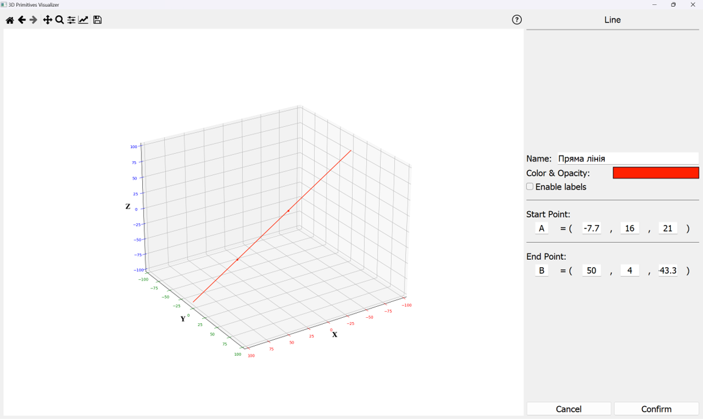
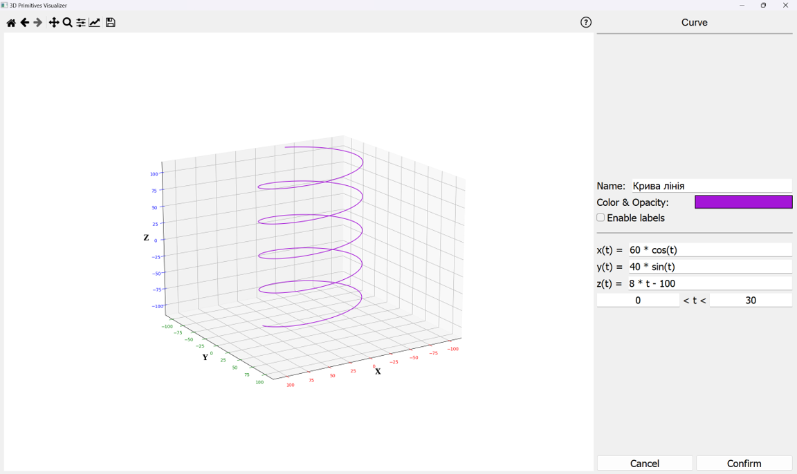
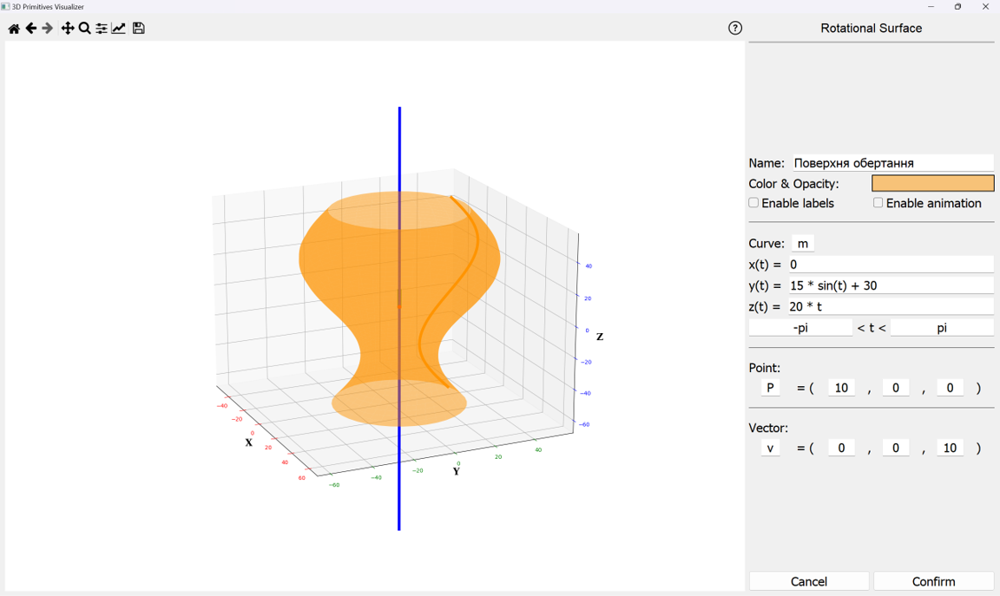
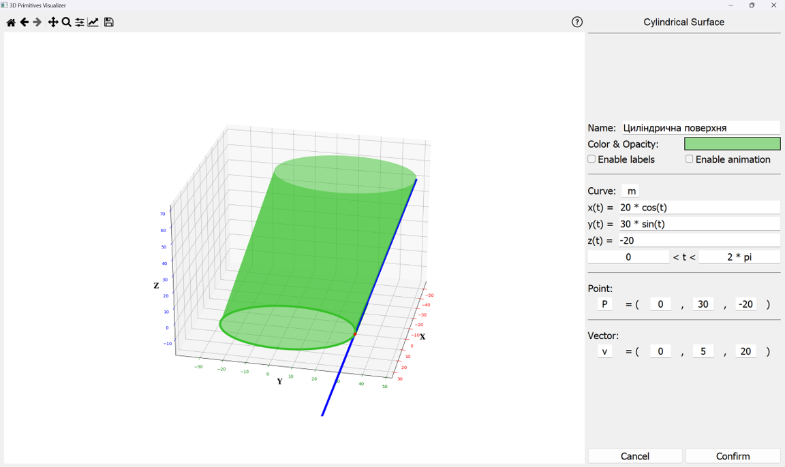
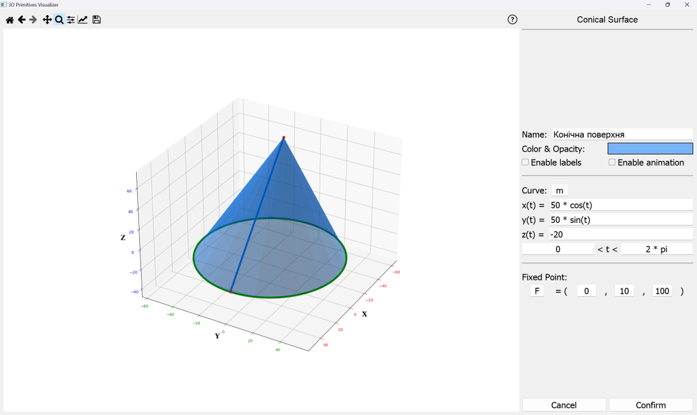
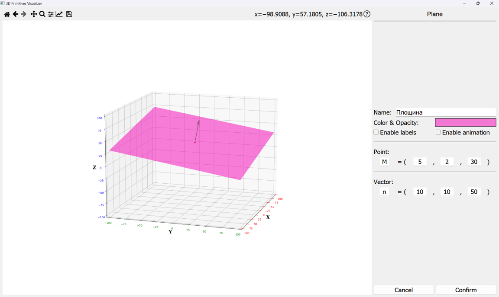
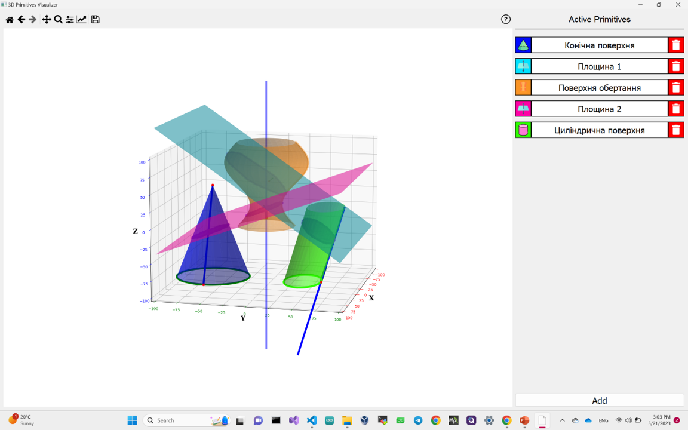

# Загальний опис
Цей репозиторій містить у собі вихідний код програмного продукту. Програмний код знаходиться у папці [/src](https://github.com/chinazys/3D_primitives_visualizer/tree/main/src) і складається з 3 основних частин:
- [/src/primitives](https://github.com/chinazys/3D_primitives_visualizer/tree/main/src/primitives) – містить реалізацію класів графічних примітивів, які будує програма (пряма лінія, крива лінія, циліндрична поверхня, поверхня обертання, конічна поверхня, площина);
- [/src/ui](https://github.com/chinazys/3D_primitives_visualizer/tree/main/src/ui) – містить реалізацію інтерфейсу користувача, включаючи канвас для відображення доданих графічних примітивів у тривимірній системі координат та специфічні меню для відображення параметрів доданих графічних примітивів і їхнього редагування;
- [/src/utils](https://github.com/chinazys/3D_primitives_visualizer/tree/main/src/util) – містить реалізацію деякого додаткового функціоналу.

Програмний продукт було розроблено з використанням мови Python (версія 3.9) та наступних бібліотек: Matplotlib (версія 3.7.1), PyQT5 (версія 5.15.9), NumPy (версія 1.22.0), SymPy (версія 1.11.1) та PyInstaller (версія 5.9.0). Нижче наведено краткий опис та інструкції по встановленню кожної з них:
- [Matplotlib](https://matplotlib.org/stable/index.html) – це бібліотека для візуалізації даних та побудови графіків у мові програмування Python. Вона також надає інструменти для побудови геометричних об'єктів.
```console
pip install matplotlib
```
- [SymPy](https://www.sympy.org/en/index.html) є бібліотекою символьних обчислень для мови програмування Python.
```console
pip install sympy
```
- [NumPy](https://numpy.org/) є бібліотекою для наукових обчислень у мові програмування Python. Вона в тому числі надає інструменти для роботи із масивами чисел та для обчислень лінійної алгебри.
```console
pip install numpy
```

- [PyQt](https://doc.qt.io/qtforpython-5/) - це набір бібліотек інструментів, які надають можливість розробки графічних інтерфейсів користувача (GUI) на мові програмування Python.
```console
pip install PyQt5
```

- [PyInstaller](https://pyinstaller.org/en/stable/) є одним з інструментів для упаковки Python-програм у виконувані файли для різних платформ (Windows, macOS, Linux). Він дозволяє створювати самодостатні програми, які можна виконувати на комп'ютерах, де не встановлено Python-інтерпретатор.
```console
pip install pyinstaller
```

# Можливості програмного продукту
В результаті роботи створено додаток 3DVisualizer. Він має наступні можливості:
1. Побудова прямих та кривих ліній, площин, поверхонь обертання, конічних та циліндричних площин;
2. Анімація побудови поверхонь;
3. Побудова перерізу поверхні та площини;
4. Обертання отриманої візуалізації, огляд її з будь-якої сторони та з різним масштабом;
5. Зручне редагування доданих графічних примітивів;
5. Збереження результатів у графічному форматі.

# Алгоритм встановлення програмного забезпечення
Для встановлення програмного забезпечення необхідно виконати наступні кроки:
1. Перейти на GitHub сторінку репозиторія за посиланням: https://github.com/chinazys/3D_primitives_visualizer/tree/main
2. Завантажити репозиторій як архів. Для цього, треба натиснути на зелену кнопку "Code", розташовану у правій частині верхнього меню, після чого обрати опцію "Download ZIP". Альтернативно виконати завантаження програмного коду можна за допомогою git:
```console
git clone https://github.com/chinazys/3D_primitives_visualizer.git
```
3. Відкрити Провідник, перейти до завантаженого фолдеру "3DVisualizer" й при необхідності розпакувати його
4. Відкрити отриману папку та виконати файл [main.py](https://github.com/chinazys/3D_primitives_visualizer/tree/main/src/main.py), розташований у корені папки [/src](https://github.com/chinazys/3D_primitives_visualizer/tree/main/src). Для цього виконати:
```console
your@username:/3DPrimitives_visualizer/src $ python3 src/main.py
```

# Приклади побудованих фігур у застосунку
## Пряма лінія

## Крива лінія

## Поверхня обертання

## Циліндрична поверхня

## Конічна поверхня

## Площина

## Переріз поверхонь площиною
